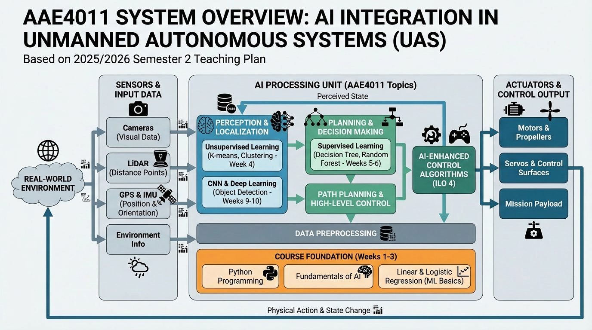

# AAE4011-S22526

Lecture page for AAE4011, Semester 2, 2025-2026

## AAE4011, [Artificial Intelligence for Unmanned Autonomous Systems](https://github.com/weisongwen/AAE4011-S22526)

This is the Github page for lecture AAE4011, Artificial Intelligence for Unmanned Autonomous Systems. This page will include example code and learning materials. Students can raise issues from this Github repository through [Issue](https://github.com/weisongwen/AAE4011-S22526/issues).

<p align="center">
  
</p>

- **Lecturer**: [Dr. Weisong Wen](https://www.polyu.edu.hk/aae/people/academic-staff/dr-wen-weisong/), [Department of Aeronautical and Aviation Engineering](https://www.polyu.edu.hk/aae/) (AAE)
- **Address**: R820, PolyU
- **Email**: welson.wen@polyu.edu.hk
- **Teaching Assistants**: Naigui Xiao, Xiangru Wang, Qi Zhang, Junzhe Wang
- **Lecture Venue and Time**: BC302, Tue 12:30-15:20PM

## Subject Intended Learning Outcomes (ILOs)

Upon completion of the subject, students will be able to:

1. Apply AI algorithms or adopt AI tools in solving engineering problems in unmanned autonomous systems
2. Understand the relationship between multiple functions of unmanned autonomous systems, including perception, path planning, decision making, and control
3. Design partial functions of typical unmanned autonomous systems, such as positioning and path planning
4. Improve the existing AI algorithms for specific unmanned autonomous systems applications

## Grading Policy

- **Mid-Term Test**: 15%
- **Homework Assignment**: 20%
- **Group Project**: 15%
- **Final Examination**: 50%

## Class Schedule (Tentative)

| Sem. Week | Topics Taught | Assessment |
|-----------|---------------|------------|
| Week 1 (13 Jan) | Introduction of AI for Unmanned Autonomous Systems: Introduction of the background, history, and fundamentals of AI for unmanned autonomous systems | In-class quizzes |
| Week 2 (20 Jan) | Fundamentals of Programming for AI: Fundamentals of Programming with Python for AI; basics of Python grammar with example code | In-class quizzes |
| Week 3 (27 Jan) | Linear & Logistic Regression: Linear regression and logistic regression from theory to application with example code | In-class quizzes |
| Week 4 (3 Feb) | Unsupervised Learning: K-means and clustering methods with example code in Python | In-class quizzes |
| Week 5 (10 Feb) | Supervised Learning (Part 1): Decision tree and random forest with example code in Python | In-class quizzes |
| **16-22 Feb** | **Lunar New Year Break - No Class** | - |
| Week 6 (24 Feb) | Supervised Learning (Part 2): Optimization for supervised learning with example code in Python | In-class quizzes |
| Week 7 (3 Mar) | Lab Session: Lab sessions for supervised and unsupervised learning | In-class quizzes |
| Week 8 (10 Mar) | **Mid-term Exam**: Assessment of understanding of topics covered in Weeks 1-7 | **15%** |
| Week 9 (17 Mar) | Multiple Layer Perceptron & CNN (Part 1): Introduction of CNN and multiple-layer perceptron with example code in Python | In-class quizzes |
| Week 10 (24 Mar) | Multiple Layer Perceptron & CNN (Part 2): Advanced topics in CNN and deep learning applications in unmanned autonomous systems | In-class quizzes |
| Week 11 (31 Mar) | Case Study Presentation (Part 1): Group presentation on machine learning topics and submission of project report | **15%** |
| Week 12 (7 Apr) | **No Class - Easter Holiday** (The day following Easter Monday) | - |
| Week 13 (14 Apr) | Case Study Presentation (Part 2): Group presentation on machine learning topics and submission of project report | **15%** |

## Important Dates

- **Semester 2 Teaching Period**: 12 Jan - 18 Apr 2026 (13 teaching weeks)
- **Easter Holidays**: 3-7 Apr 2026 (Good Friday, following day, Ching Ming, Easter Monday following)
- **Revision Days**: 20-22 Apr 2026
- **Final Exam Period**: 23 Apr - 9 May 2026 (50%)

## Notes

- All classes are held at **BC302** on **Tuesdays, 12:30-15:20**. Students are expected to attend all lectures.
- Homework assignments will be announced during lectures with specific deadlines.
- This teaching plan is tentative and subject to adjustment based on actual teaching progress.

## Repository Structure

This repository contains two main components:

### 1. Lecture Slide Code (Standalone Python)

Located in `lecture_slide_code/`, these are standalone Python examples that can be run directly or in Google Colab.

```
lecture_slide_code/
├── week_1/    # Object detection with YOLOv5, Gauss-Newton
├── week_2/    # Logistic regression, interactive UI
├── week_3/    # Trajectory evaluation
└── ...
```

### 2. ROS Package

Located in `ros_package/aae4011_ai_uas/`, this is a ROS 1 (Noetic) package for integrating AI algorithms with robotic systems.

```
ros_package/
└── aae4011_ai_uas/
    ├── launch/     # Launch files
    ├── scripts/    # Python ROS nodes
    ├── src/        # Python modules
    └── config/     # Configuration files
```

**ROS Package Features:**
- Object Detection Node (YOLOv5)
- Trajectory Visualization Node
- Logistic Regression Node

**Installation:**
```bash
cd ~/catkin_ws/src
git clone https://github.com/weisongwen/AAE4011-S22526.git
ln -s AAE4011-S22526/ros_package/aae4011_ai_uas .
cd ~/catkin_ws
catkin_make
source devel/setup.bash
```

**Usage:**
```bash
roslaunch aae4011_ai_uas demo.launch
```

For detailed ROS package documentation, see [ros_package/aae4011_ai_uas/README.md](ros_package/aae4011_ai_uas/README.md).

## Questions

Students can raise issues from this Github repository through the [Issue](https://github.com/weisongwen/AAE4011-S22526/issues) section.

## Contact

### General Inquiry

**Dr. Weisong Wen** | [E-Mail](mailto:welson.wen@polyu.edu.hk) | [Github](https://github.com/weisongwen)
