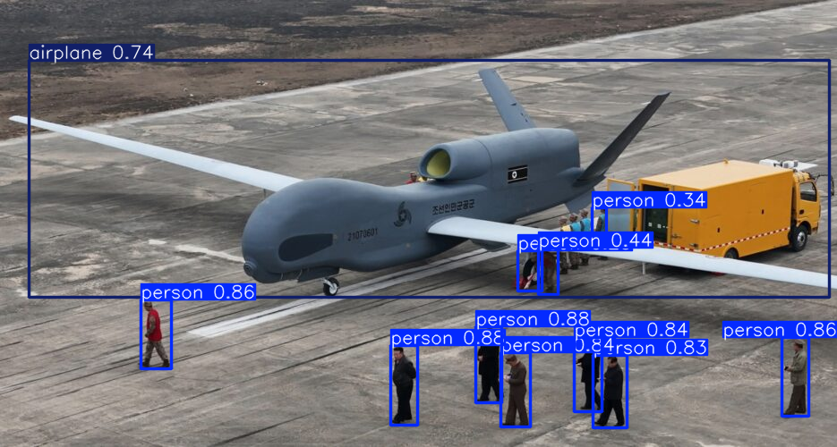

# Week 1: Introduction of AI for Unmanned Autonomous Systems

This folder contains example code for Week 1 of AAE4011 - Artificial Intelligence for Unmanned Autonomous Systems.

## Overview

The code examples demonstrate object detection using YOLOv5 (You Only Look Once version 5), a state-of-the-art real-time object detection system. These examples progressively build from basic detection to more advanced features including people counting and interactive image upload.

## Files Description

### 1. `task1_code_detection.py`
**Basic Object Detection**

This is the simplest example that demonstrates basic object detection using YOLOv5.

**Features:**
- Loads a pre-trained YOLOv5 model
- Performs object detection on a single image
- Displays the original and detected images
- Saves the detection results

**Usage:**
- Update the `img_path` variable with your image path (default: `/content/0000001_04527_d_0000008.jpg`)
- Run all cells in Google Colab

### 2. `task2_code_detection_and_count.py`
**Object Detection with People Counting**

This example extends the basic detection with detailed people counting and comprehensive detection information.

**Features:**
- Object detection using YOLOv5
- **People counting**: Specifically counts the number of people detected in the image
- Detailed detection information for each person (confidence scores)
- Summary of all detected objects
- Enhanced visualization with larger figure sizes
- Saves detection results to file

**Usage:**
- Option 1: Upload an image using the commented code section
- Option 2: Update the `img_path` variable with your image path (default: `/content/test.jpg`)
- Run all cells in Google Colab

**Output:**
- Number of people detected
- Confidence scores for each person
- List of all detected objects with their confidence levels
- Visualized detection results with bounding boxes

### 3. `task3_code_detection_count_ui.py`
**Interactive Detection with Image Upload UI**

This version provides an interactive interface for uploading images directly in Google Colab.

**Features:**
- **Interactive image upload**: Uses Google Colab's file upload interface
- Object detection and people counting
- Clean, user-friendly output with emoji indicators
- Simplified code structure for easier understanding

**Usage:**
1. Run the code in Google Colab
2. When prompted, click "Choose Files" to upload an image
3. The detection will run automatically on the uploaded image

**Output:**
- Number of people detected (with visual indicator)
- Confidence scores for each detected person
- Visualized detection results

## Requirements

All code files are designed to run on **Google Colab**. The following packages are automatically installed:

- `torch` (PyTorch)
- `torchvision`
- `torchaudio`
- `ultralytics` (for YOLOv5)
- `PIL` (Pillow) - for image processing
- `matplotlib` - for visualization

## Getting Started

1. **Open Google Colab**: Go to [Google Colab](https://colab.research.google.com/)

2. **Upload the code**: 
   - Create a new notebook
   - Copy and paste the code from one of the task files
   - Or upload the `.py` file directly

3. **Run the code**:
   - For `task1` and `task2`: Make sure to upload your image to `/content/` folder first, or modify the image path
   - For `task3`: Simply run the code and use the upload interface

4. **View results**: The detection results will be displayed inline in the notebook

## Model Information

All examples use the **YOLOv5s** model (small version), which is:
- Pre-trained on the COCO dataset
- Capable of detecting 80 different object classes
- Optimized for speed and accuracy
- Suitable for real-time applications

## Example Results

The YOLOv5 model can detect various objects in images. Here's an example of detection results on an aerial image:

### Detection Example: Aerial View of UAV/Drone

  

**Scene Description:**
- An aerial view of a large unmanned aerial vehicle (UAV) on an airfield tarmac
- Multiple people and vehicles in the scene

**Detected Objects:**

1. **Airplane (UAV/Drone)**
   - Confidence: 0.74
   - Large bounding box encompassing the entire drone
   - Detected as "airplane" class

2. **People Detection**
   - Multiple individuals detected around the drone:
     - Person near left wing: confidence 0.86
     - Person under right wing: confidence 0.34
     - Person under right wing: confidence 0.44
     - Group of people in lower right: 6 people detected with confidences ranging from 0.83 to 0.88
   - **Total people count: 9** (example output from Task 2 or Task 3)

3. **Truck**
   - Yellow truck detected behind the right wing of the drone
   - Visible in the detection results

**Key Observations:**
- The model successfully identifies the main aircraft object despite its large size
- People are accurately detected even when partially visible or at different distances
- Multiple object classes (airplane, person, truck) are detected simultaneously
- Confidence scores help assess the reliability of each detection

This example demonstrates the model's capability to handle complex scenes with multiple objects, which is particularly relevant for unmanned autonomous systems applications where detecting aircraft, people, and vehicles is crucial.

## Differences Between Tasks

| Feature | Task 1 | Task 2 | Task 3 |
|---------|--------|--------|--------|
| Basic Detection | ✅ | ✅ | ✅ |
| People Counting | ❌ | ✅ | ✅ |
| Detailed Statistics | ❌ | ✅ | ❌ |
| Image Upload UI | ❌ | ❌ | ✅ |
| All Objects Summary | ❌ | ✅ | ❌ |

## Notes

- All code files include IPython-specific syntax (`!pip install`, `# %%` cell markers) that work in Jupyter/Colab environments
- The code assumes images are stored in `/content/` directory (default Colab working directory)
- Detection results are saved automatically in Task 1 and Task 2
- Task 3 provides the most user-friendly experience with interactive upload

## Troubleshooting

**Issue: Image not found**
- Make sure the image path is correct
- For Task 1 and Task 2, upload your image to `/content/` folder first
- For Task 3, use the upload interface provided

**Issue: Model loading takes time**
- First-time model download may take a few minutes
- The model will be cached for subsequent runs

**Issue: Detection not working**
- Ensure all packages are installed correctly
- Check that your image format is supported (JPG, PNG, etc.)

## Course Information

- **Course**: AAE4011 - Artificial Intelligence for Unmanned Autonomous Systems
- **Semester**: 2, 2025-2026
- **Lecturer**: Dr. Weisong Wen
- **Email**: welson.wen@polyu.edu.hk
- **Department**: Aeronautical and Aviation Engineering (AAE), The Hong Kong Polytechnic University

## License

Copyright (c) 2025-2026  
This code is provided for educational purposes as part of the AAE4011 course.  
All rights reserved.
